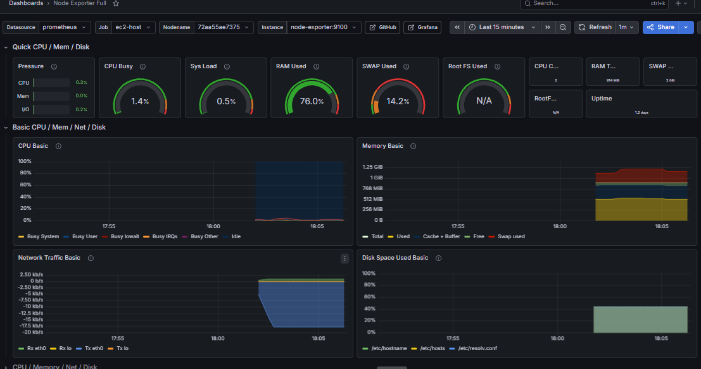

# ☁️ CloudMart-DevOps: Microservices Migration & Orchestration

**CloudMart** is a production-grade e-commerce platform built to document the full lifecycle of a DevOps transformation—from a local `docker-compose` stack to a fully automated, observable Kubernetes deployment. 

**Stack at a glance:** `Python` • `Flask` • `React` • `MySQL` • `Docker` • `Kubernetes (Minikube)` • `Helm` • `Terraform` • `AWS (RDS, VPC, EC2, ECR)` • `GitHub Actions` • `Prometheus` • `Grafana` • `Discord Alerts` • `Nginx Ingress`

---

## 🏗️ Architecture Overview

The system consists of independent microservices communicating with an AWS RDS MySQL backend, managed by a CI/CD feedback loop.


*The DevOps Lifecycle: From Git Push to Discord Alert.*

---

## 🛠️ Technical Deep Dive

### Phase 1 — Containerization & Helm Modularization
**The Problem:** Monolithic development environments make it hard to test microservice interactions or scale individual components.
**What was built:** Decoupled Flask microservices packaged into a modular **Helm Chart** system for environment-agnostic deployments.


### Phase 2 — Infrastructure as Code (IaC) & Cloud Migration
**The Problem:** Manual cloud configuration leads to "Configuration Drift." Production needs repeatable, managed infrastructure.
**What was built:** All AWS infrastructure is defined in **Terraform**, featuring a custom VPC and an **AWS RDS (MySQL 8.0)** managed database.


### Phase 3 — CI/CD Automation
**The Problem:** Manual deployments are slow and error-prone.
**What was built:** Automated **GitHub Actions** pipelines for building, testing, and pushing images to **AWS ECR**.


### Phase 4 — Kubernetes & Full-Stack Observability
**The Problem:** Plain YAML manifests are difficult to version or roll back.
**What was built:** Advanced Kubernetes orchestration with strict resource limits and a complete monitoring stack capturing both **Application** and **Infrastructure** metrics.

#### 📊 Infrastructure & Node Health
Using **Node Exporter**, I implemented deep-level monitoring of the underlying host. This ensures visibility into CPU load, memory saturation (currently at 76%), and network throughput, allowing for proactive scaling before pods are impacted.



#### 📈 Application Performance & Alerting
Stress-testing was performed using **Apache Benchmark (ab)**. I configured **Grafana Alerting** to send real-time "Fire Alerts" to **Discord** when CPU thresholds were breached.

| Load Test CPU Spike | Discord Alert Triggered | Discord Alert Resolved |
| :--- | :--- | :--- |
|  |  |  |

---

## 🔍 Cluster Health & Workload Status

| K8s Workload Status | Memory Utilization | Replica Sets |
| :--- | :--- | :--- |
|  |  |  |

---

## 📂 Project Structure
```text
CloudMart-DevOps/
├── product-service/       # Flask API — Product Catalog
├── user-service/          # Flask API — Auth & User Management
├── order-service/         # Flask API — Order Processing
├── frontend/              # React App (Dark Mode)
├── terraform/             # AWS Infrastructure (VPC, RDS, EC2)
├── cloudmart-chart/       # Helm Chart (Modular K8s Packaging)
├── monitoring/            # Prometheus + Grafana Configs
└── .github/workflows/     # CI/CD Pipelines
