# ☁️ CloudMart-DevOps: Microservices Migration & Orchestration

**CloudMart** is a production-grade e-commerce platform built to document the full lifecycle of a DevOps transformation—from a local `docker-compose` stack to a fully automated, observable Kubernetes deployment. This repository is a commit-by-commit record of every architectural decision, infrastructure choice, and automation layer added along the way.

**Stack at a glance:** `Python` • `Flask` • `React` • `MySQL` • `Docker` • `Kubernetes (Minikube)` • `Helm` • `Terraform` • `AWS (RDS, VPC, EC2, ECR)` • `GitHub Actions` • `Prometheus` • `Grafana` • `Discord Alerts` • `Nginx Ingress`

---

## 🏗️ Architecture Overview

The system consists of independent microservices communicating with an AWS RDS MySQL backend, managed by a CI/CD feedback loop.

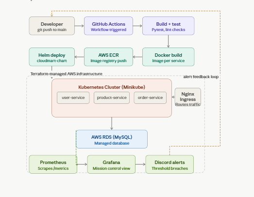
*The full lifecycle: A git push to main triggers GitHub Actions, which runs tests, builds Docker images, pushes them to AWS ECR, and deploys via Helm to the cluster.*

---

## 🛠️ Technical Deep Dive

### Phase 1 — Containerization & Local Orchestration
**The Problem:** Monolithic development environments make it hard to test microservice interactions or scale individual components.
**What was built:** Three independent Flask services (`user`, `product`, `order`) and a React frontend. We utilized **Helm** to modularize the deployment, allowing for versioned releases.

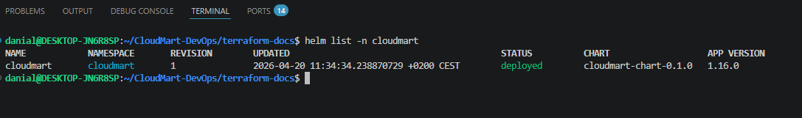

### Phase 2 — Infrastructure as Code (IaC) & AWS Migration
**The Problem:** Manual cloud configuration leads to "Configuration Drift." Production needs repeatable, managed infrastructure.
**What was built:** All AWS infrastructure is defined in **Terraform**. This includes a modular VPC and an **AWS RDS (MySQL 8.0)** instance. RDS provides automated backups and high availability.

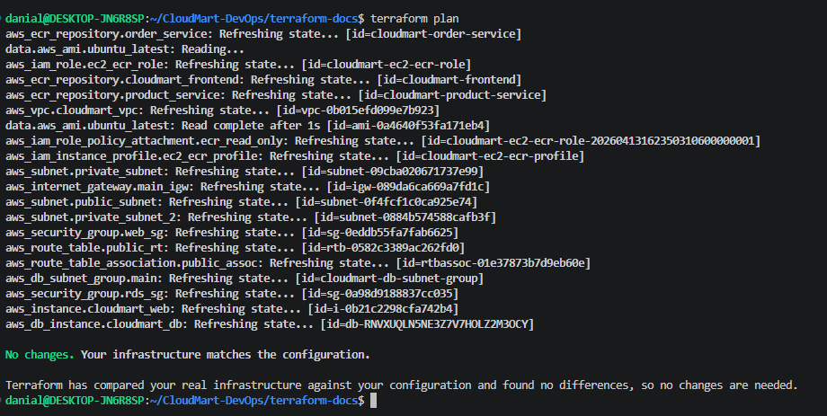
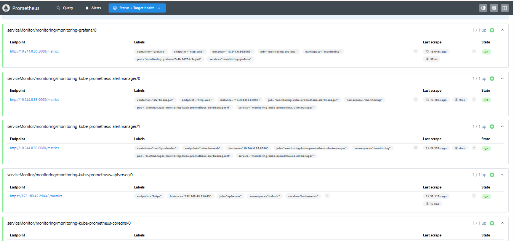

### Phase 3 — CI/CD Automation
**The Problem:** Manual deployments are slow and error-prone.
**What was built:** GitHub Actions pipelines that automate the entire flow:
1. **Lint/Test:** Ensuring code quality before build.
2. **Docker Build:** Using `build-args` to inject dynamic environment variables.
3. **Registry Push:** Pushing versioned images to **AWS ECR**.

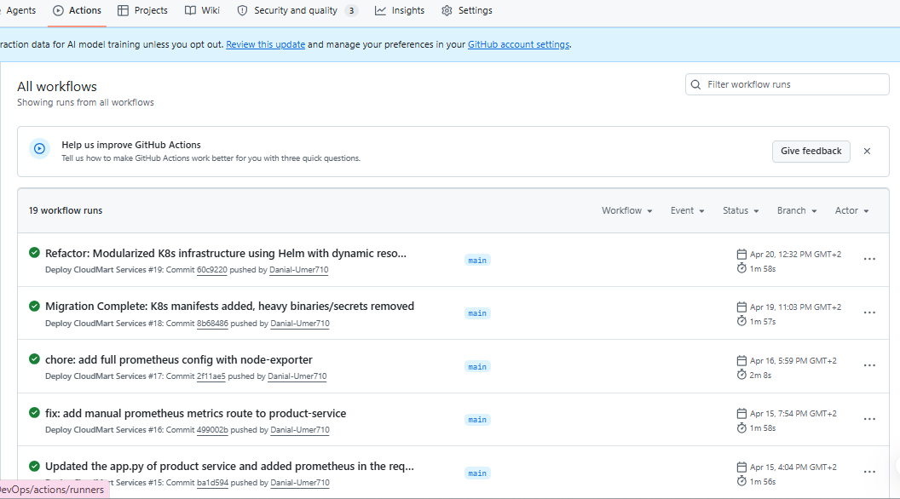

### Phase 4 — Kubernetes & Full-Stack Observability
**The Problem:** Plain YAML manifests are difficult to version or roll back.
**What was built:** Refactored manifests into a **Modular Helm Chart**. Deployed on a Kubernetes cluster with strict **Resource Requests and Limits** to prevent service starvation.

#### 📊 Performance & Alerting
We didn't just deploy; we monitored. Using **Apache Benchmark (ab)**, we stress-tested the `product-service` to verify our observability stack.

* **Prometheus:** Scrapes `/metrics` from Flask pods and Node Exporter.
* **Grafana:** A "Mission Control" view of CPU, Memory, and Pod Health.
* **Discord Integration:** Configured Grafana Alerting to send notifications to Discord when CPU thresholds were breached.

| Load Test CPU Spike | Discord Alert Triggered | Discord Alert Resolved |
| :--- | :--- | :--- |
| 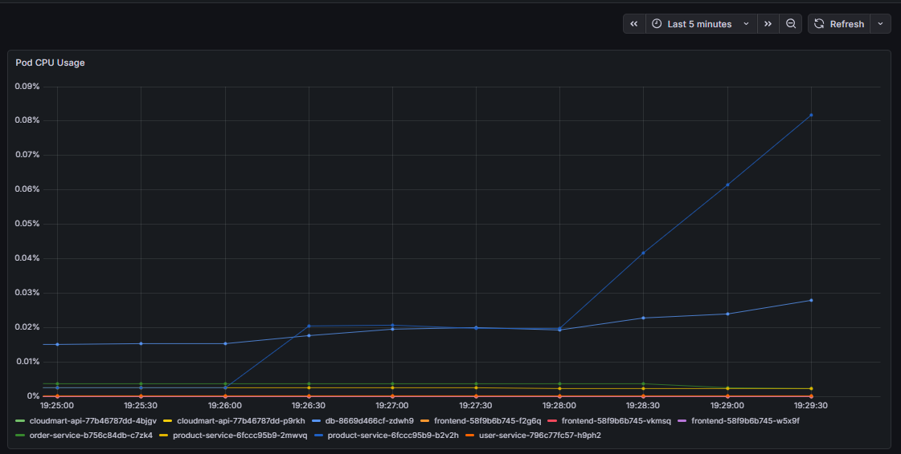 | 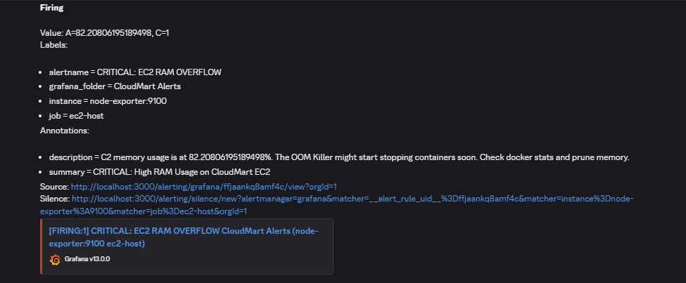 | 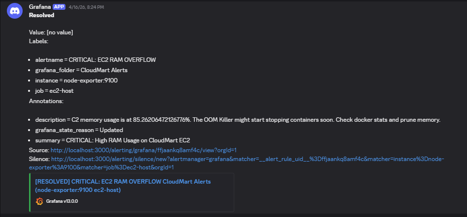 |

---

## 🔍 Cluster Health & Status

| K8s Workload Status | Memory Utilization | Replica Sets |
| :--- | :--- | :--- |
| 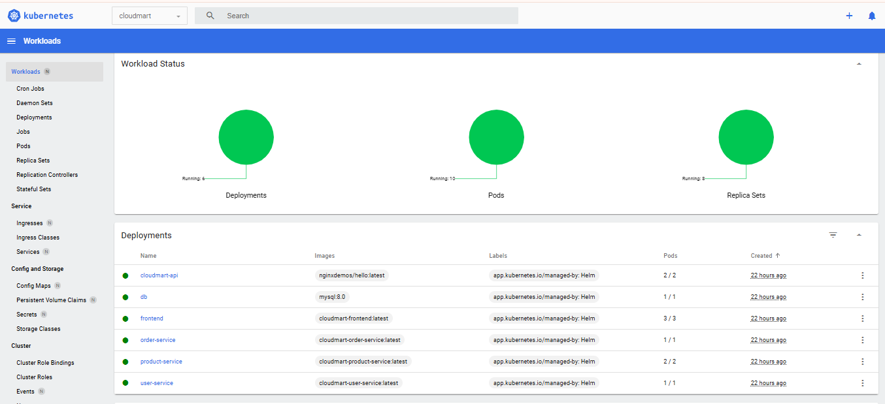 | 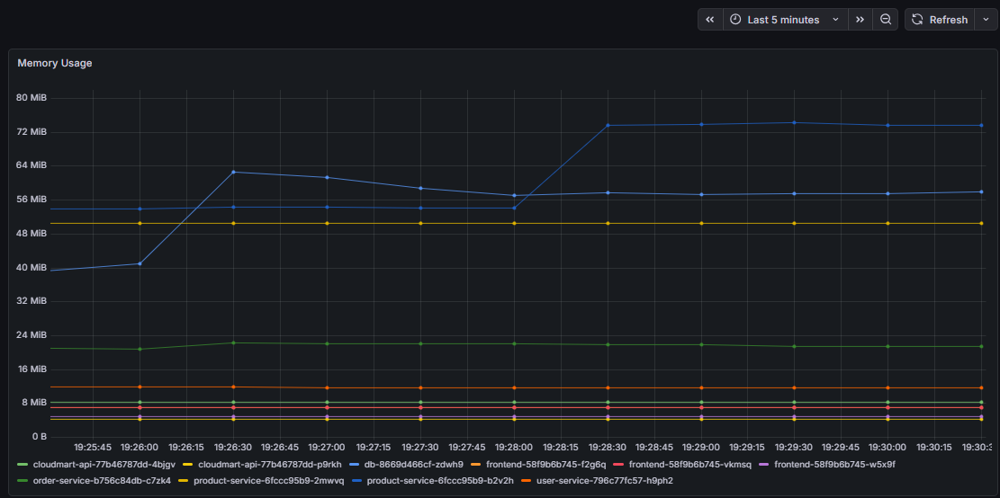 | 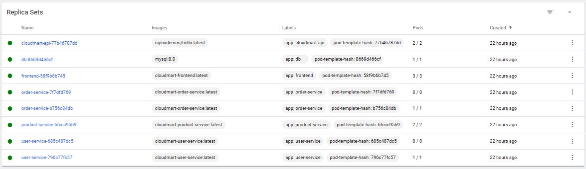 |

---

## 📂 Project Structure
```text
CloudMart-DevOps/
├── product-service/       # Flask API — Product Catalog
├── user-service/          # Flask API — Auth & User Management
├── order-service/         # Flask API — Order Processing
├── frontend/              # React App (Dark Mode)
├── terraform/             # AWS Infrastructure (VPC, RDS, EC2)
├── cloudmart-chart/       # Helm Chart (Modular K8s Packaging)
├── monitoring/            # Prometheus + Grafana Configs
└── .github/workflows/     # CI/CD Pipelines
